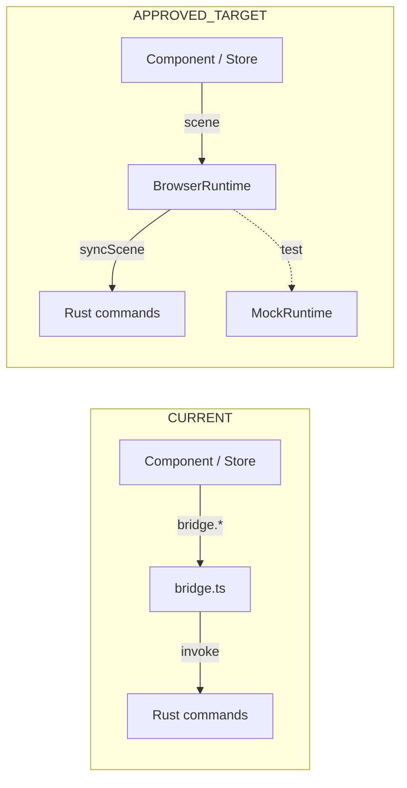
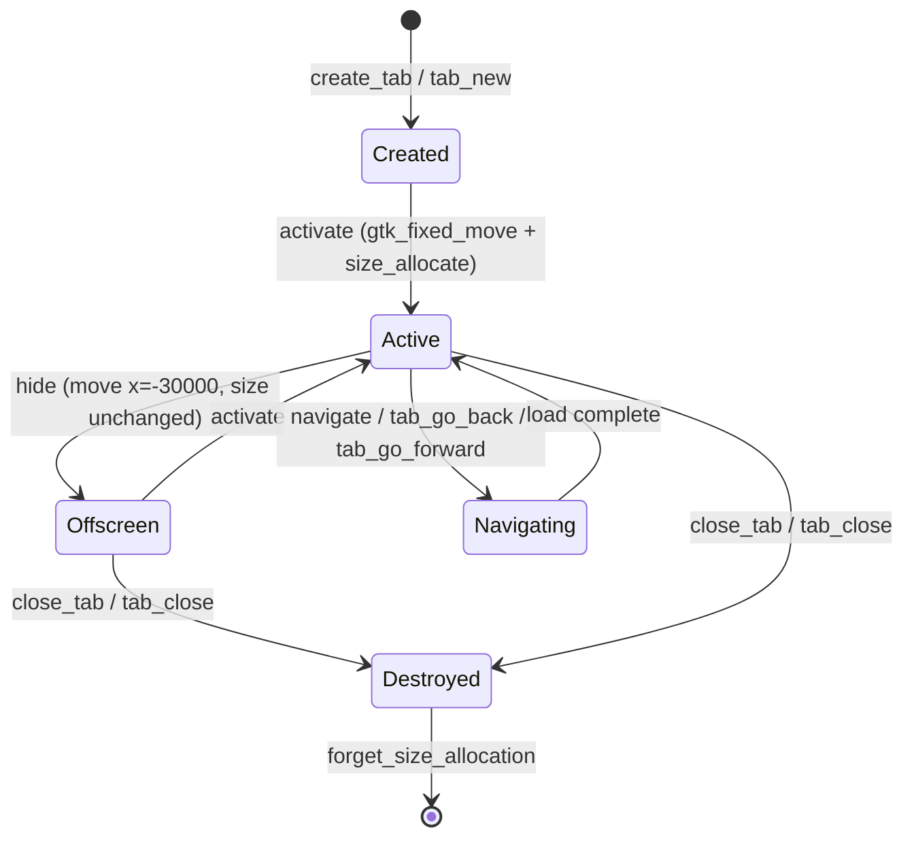
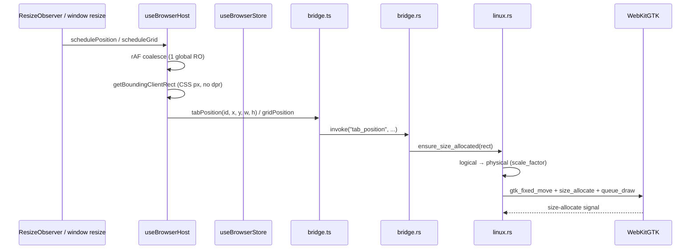
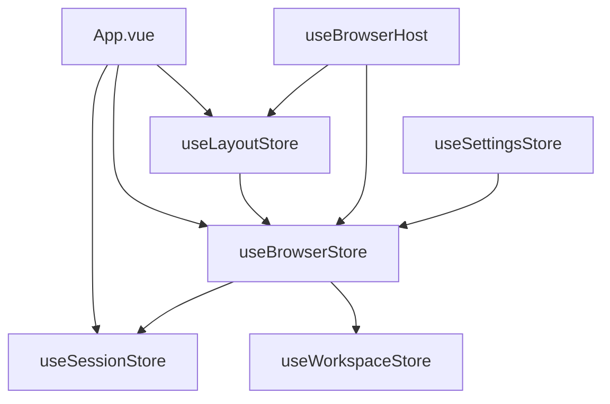

# 00 Architecture

Status: Phase 02 expanded (verified against source).

This document is the architecture source for AI collaboration. It describes current behavior separately from approved targets, pending decisions, and deprecated behavior. Every `CURRENT` claim has been verified against source files on 2026-09-10.

Label discipline (mirrors `PROJECT-RULES.md`):

- `CURRENT`: verified current implementation.
- `APPROVED_TARGET`: approved behavior that is not fully implemented yet.
- `PENDING`: decision waiting for the user; must not be implemented.
- `DEPRECATED`: behavior that must not be restored.

---

## 1. Current System

`CURRENT`

- **Frontend shell**: Vue 3 (`^3.4.0`) + TypeScript, built with Vite 5. Entry `src/main.ts` → `src/App.vue`.
- **State management**: Pinia (`^2.3.1`), 19 stores in `src/stores/`.
- **Native backend**: Tauri 2 (unstable, protocol-asset) + Rust. Entry `src-tauri/src/main.rs` (~1565 lines), library boundary `src-tauri/src/lib.rs` (`mvp_core`).
- **Native child WebViews**: Linux GTK / WebKitGTK. Child webviews are `GtkFixed` children, not DOM elements. HTML `z-index` cannot reliably cover them.
- **Custom plugin**: `tauri-plugin-browser-tabs` (path dependency `tauri-browser-tabs/`), owns tab/grid webview lifecycle and the WebKitGTK `size_allocate` fix.
- **IPC bridge**: `src/bridge.ts` (~747 lines) is the current de-facto unified invoke layer. Every method wraps `@tauri-apps/api/core` `invoke`. Stores and composables import `bridge`, not `invoke` directly.
- **Layout scheduler**: `src/composables/useBrowserHost.ts` (~207 lines) is the single webview positioning scheduler. One global `ResizeObserver`, per-frame coalescing, pure CSS-pixel coordinates (no `devicePixelRatio` multiply).
- **Rust command surface**: `src-tauri/src/bridge.rs` (~7170 lines) exports ~140 `#[tauri::command]` functions across browser, grid, session, git, script, file, database, terminal, graph, plugin, agent/skill, mcp, artifact, bookmark, and vault domains.
- **Library boundary**: `src-tauri/src/lib.rs` defines `mvp_core` (same-package dual target). Boundary rules R-B1..R-B5 are statically enforced by `scripts/check-core-boundary.py` (the compiler cannot enforce R-B1).
- **Permissions**: `src-tauri/permissions/remote-collect.toml` whitelists commands callable from remote child webviews (`tab-*` / `grid-*` on http(s) origins). `src-tauri/capabilities/browser-remote.json` binds that scope. Adding a new invoke from injected collect scripts requires syncing both the toml and `generate_handler!`.
- **Packaging**: Debian `.deb` via `tauri build -- --bundles deb`. `tauri.conf.json` sets `withGlobalTauri: true`, `csp: null`, `bundle.targets: "all"`.

### 1.1 Native WebView positioning (CURRENT, locked)

Source: `tauri-browser-tabs/crates/tauri-plugin-browser-tabs/src/platform/linux.rs`

`ensure_size_allocated` is the single correction path for child webview geometry:

1. `gtk_fixed_move(child, x, y)` — fixes position (wry `set_bounds` only `size_allocate`s GtkFixed children, position drifts).
2. `size_allocate(&Allocation::new(x, y, w, h))` — fixes size + position, emits `size-allocate` so WebKit refreshes the CSS viewport.
3. `queue_draw()` — triggers repaint.
4. `x < -1000` → `set_child_visible(false)` (move offscreen; the WebView process may remain alive, but the widget is no longer drawn).

Hidden tabs are moved to `x = -30000` with size unchanged (never `webview.hide()`, never shrink to 1x1). See `PROJECT-RULES.md` rules 1, 3.5.

### 1.2 Component invoke discipline (CURRENT)

`src/components/**` contains zero direct `invoke` calls (verified by grep; the 4 `invoke` occurrences are all comments stating "组件不直接 invoke"). All native calls flow through `src/bridge.ts`.

---

## 2. Architecture Boundaries

### 2.1 `CURRENT`

- **Component → bridge**: Vue components do not directly call `@tauri-apps/api/core` `invoke`. They import `bridge` from `src/bridge.ts`.
- **Store → bridge**: Stores call `bridge.*` methods, not `invoke` directly.
- **Composable → bridge**: `useBrowserHost.ts` calls `bridge.tabPosition` / `bridge.gridPosition` / `bridge.gridSetZoom` / `bridge.hideWebview` / `bridge.hideAllWebviews`.
- **Library boundary**: `mvp_core` (`src-tauri/src/lib.rs`) separates pure logic from the Tauri app; enforced by `scripts/check-core-boundary.py`.
- **Native danger zone**: `src-tauri/src/bridge.rs`, `src-tauri/src/**/linux.rs`, `src-tauri/capabilities/**`, `tauri-browser-tabs/**` require explicit task authorization (per `AGENTS.md` §4).

### 2.2 `APPROVED_TARGET`

- **BrowserRuntime adapter**: `src/bridge.ts` is the factual precursor but lacks an interface abstraction, a `syncScene(scene)` declarative contract, and a mock implementation. The approved target is to formalize it as `BrowserRuntime` with `MockRuntime`. Not yet in source (grep `BrowserRuntime` / `MockRuntime` in `src/` → 0 hits).
- **BrowserScene**: A single synchronization contract for visible tabs, grid state, viewport rects, and offscreen hiding. Only in design docs (grep `BrowserScene` in `src/` → 0 hits).
- **`src/domain/` and `src/application/` layers**: Listed as safe zones in `AGENTS.md` §3 but the directories do not exist yet.
- **`syncScene` unified native interface**: Planned in `PLANS.md` Phase 5; 0 hits in source.
- **WebViewSafeShell / BrowserViewportAnchor**: Planned in `PLANS.md` Phase 3; 0 hits in source.

### 2.3 `PENDING` (do not implement)

> **2026-09-12 Owner ruling: all four historical PENDING items in this section have been adjudicated. None remain pending.**
> See `.ai/workbuddy-dispatch/M6-A0-governance-decision-record.md`.
> A new `PENDING` may only be written here after explicit Owner adjudication.

| Former PENDING | Ruling | Source |
|---|---|---|
| Whether closing a tab should auto-save and close directly | **CLOSED / REJECTED** — normal tab close = no prompt + no persistent save + direct close | Phase 04 Owner ruling; `PROJECT-RULES.md` [DEPRECATED] `auto_save_on_close` |
| Whether to add "recently closed tabs" and `Ctrl+Shift+T` | **APPROVED / implemented** — memory-only stack (`{url,title}`) + `Ctrl+Shift+T` restore | Phase 04 (commit `acf4add`); `PROJECT-RULES.md` [APPROVED] |
| Whether native WebViews stay one-per-tab or become a 1-4 slot pool | **APPROVED_CURRENT: 1 tab = 1 native WebView.** Slot pool = `FUTURE / SEPARATE_DECISION`, forbidden in M6 | Owner ruling 3 |
| Whether the Vue shell is migrated incrementally or rewritten wholesale | **APPROVED: incremental migration.** Full rewrite = `REJECTED` | Owner ruling 4; `PROJECT-RULES.md` [APPROVED] "Vue 前端保留，后续改造成 WebView-aware Shell" |

Additional M6 constraint (Owner ruling 3 supplement): `BrowserScene` must describe the *desired browser scene* and must NOT hard-code the underlying `1 tab = 1 WebView` implementation detail into the upper-layer contract. A future slot-pool model should be swappable at the Runtime/native layer without overturning Vue Shell / BrowserScene.

### 2.4 `DEPRECATED` (must not restore)

- "New tab created" toast on tab creation.
- `set_size_request` / `queue_resize` / `auto_resize` reliance for child webview sizing (root cause of v0.3.0–v0.4.0 fill-window bugs).
- `webview.hide()` / `set_visible(false)` on a rendering WebKitGTK child (causes main-thread deadlock).
- Fixed HTML overlays (`position: fixed` + `z-index`) over the native browser viewport (`.toast-pop` etc.).
- System title bar restoration.

---

## 3. Core Areas

| Area | Current location | Status |
|---|---|---|
| IPC bridge | `src/bridge.ts` | `CURRENT` (precursor to BrowserRuntime) |
| BrowserRuntime adapter | — | `APPROVED_TARGET` |
| MockRuntime | — | `APPROVED_TARGET` |
| BrowserScene | — | `APPROVED_TARGET` |
| WebView lifecycle | `tauri-browser-tabs/.../commands.rs` (`TabManagerState`) + `src-tauri/src/bridge.rs` | `CURRENT` |
| WebView geometry fix | `tauri-browser-tabs/.../platform/linux.rs` (`ensure_size_allocated`) | `CURRENT` (locked) |
| Layout / viewport rect sync | `src/composables/useBrowserHost.ts` + `src/stores/useLayoutStore.ts` | `CURRENT` |
| Tab snapshot / workspace state | `src/stores/useBrowserStore.ts`, `useSessionStore.ts`, `useWorkspaceStore.ts` | `CURRENT` |
| Session close flow | `src/components/browser/SessionCloseDialog.vue` (three-way confirm) | `CURRENT` |
| Error / status surface | `src/components/layout/StatusBar.vue` (status bar, no toast) | `CURRENT` |
| WebViewSafeShell | — | `APPROVED_TARGET` |
| BrowserViewportAnchor | — | `APPROVED_TARGET` |
| `syncScene` native interface | — | `APPROVED_TARGET` |

---

## 4. Mermaid Diagrams

### 4.1 System overview

```mermaid
flowchart TD
  subgraph Frontend["Vue + TypeScript Shell"]
    App["App.vue"]
    Comp["components/** (61)"]
    Stores["stores/** (19)"]
    CompBridge["composables/** (3)"]
    Bridge["bridge.ts (invoke wrapper)"]
  end
  subgraph Backend["Tauri + Rust Backend"]
    Main["main.rs"]
    Lib["lib.rs (mvp_core)"]
    BridgeRs["bridge.rs (~140 commands)"]
    Modules["agent / git / db / session / ..."]
  end
  subgraph Plugin["tauri-plugin-browser-tabs"]
    Cmds["commands.rs (TabManagerState)"]
    Linux["platform/linux.rs (size_allocate fix)"]
  end
  subgraph Native["Linux Native"]
    GTK["GTK / GtkFixed"]
    WebKit["WebKitGTK child webviews"]
  end

  App --> Comp
  App --> Stores
  Comp --> Stores
  Comp --> CompBridge
  Stores --> Bridge
  CompBridge --> Bridge
  Bridge -->|invoke| Main
  Main --> Lib
  Main --> BridgeRs
  BridgeRs --> Modules
  Main -->|plugin init| Cmds
  Cmds --> Linux
  Linux --> GTK
  GTK --> WebKit
```

### 4.2 Current call boundary (CURRENT) vs target (APPROVED_TARGET)

### 4.3 WebView lifecycle (CURRENT)

### 4.4 Positioning data flow (CURRENT)

### 4.5 Module relationships (CURRENT, key stores)

---

## 5. Validation Entry Points

`CURRENT`

- `npm run build` (Vite build)
- `bash scripts/pre-merge.sh` (aggregated pre-merge gate)
- `git diff --check` (whitespace / conflict markers)
- `cargo check --manifest-path src-tauri/Cargo.toml` (Rust)
- `scripts/check-core-boundary.py` (mvp_core library boundary R-B1..R-B5)
- `scripts/check-native-webview-overlay.mjs` (no HTML overlay over native webview)
- `scripts/check-window-drag.mjs` (window drag event + permission contract)
- 17+ domain-specific `scripts/check-*-logic.mjs` / `check-*-ui-logic.mjs` checkers

`APPROVED_TARGET` (planned, not yet in source)

- `scripts/check-architecture.mjs`
- `scripts/check-ui.mjs`
- `scripts/check-native.mjs`
- `scripts/check-browser-runtime.mjs`
- `scripts/doctor.mjs`
- `scripts/check-task-boundary.mjs`

---

## 6. Current Gaps

- `BrowserRuntime` / `MockRuntime` / `BrowserScene` / `syncScene` / `WebViewSafeShell` / `BrowserViewportAnchor` are `APPROVED_TARGET` only; 0 hits in `src/`. `src/bridge.ts` is the factual precursor but is not yet formalized.
- `src/domain/` and `src/application/` directories do not exist.
- Planned checker scripts (`check-architecture.mjs`, `check-ui.mjs`, `check-native.mjs`, `check-browser-runtime.mjs`, `doctor.mjs`, `check-task-boundary.mjs`) are not yet created.
- Native GUI behavior still requires real desktop verification before `GUI_PASS`; compilation success is not GUI pass.
- The `~140` Rust commands in `bridge.rs` are a single large module; domain decomposition status is not yet mapped here.
