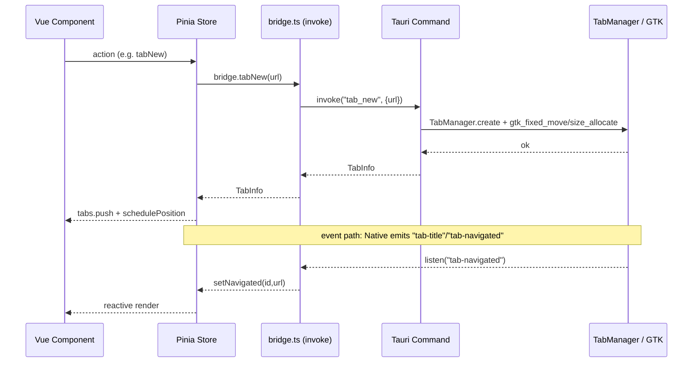
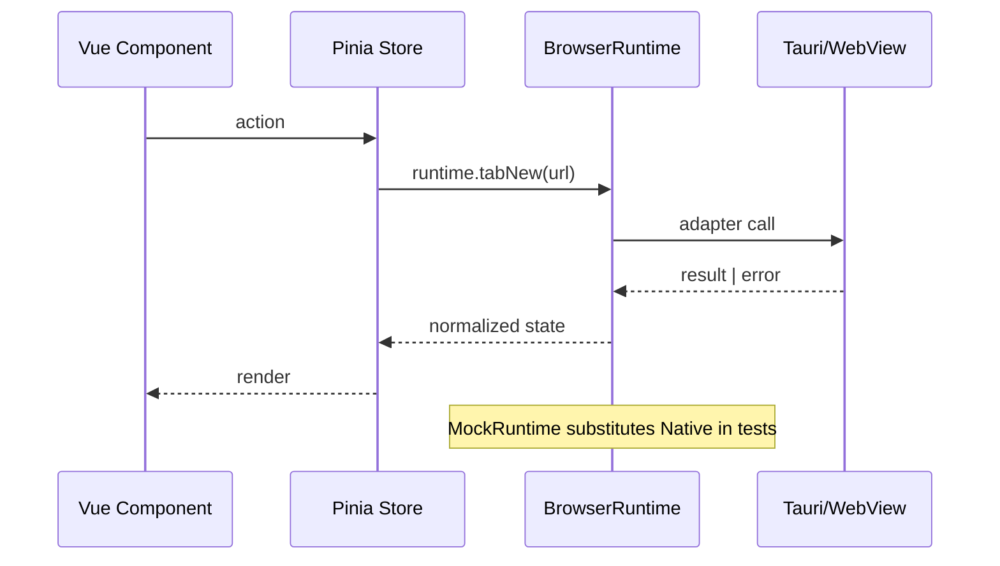

# 01 Detailed Design

Status: Phase 02 expansion (source-verified).

This is the primary detailed design document for AI-guided implementation. It must not treat pending product decisions as approved. Every major section distinguishes `CURRENT`, `APPROVED_TARGET`, `PENDING`, and `DEPRECATED`.

- `CURRENT`: verified against source in this pass.
- `APPROVED_TARGET`: approved direction not fully implemented yet.
- `PENDING`: decision waiting for the user; must not be implemented.
- `DEPRECATED`: behavior that must not be restored.

Source references use `path:line` so they can be re-verified.

## Required Sections

- BrowserRuntime
- BrowserScene
- Layout
- Sequence
- StateMachine
- Rect
- Viewport
- TabSnapshot
- Workspace
- Error
- Retry
- Data Flow
- Sequence Diagram

## BrowserRuntime

`CURRENT`: No `BrowserRuntime` / `MockRuntime` type exists in `src/`. All native calls go through `src/bridge.ts`, which is a flat object of `invoke(...)` wrappers (e.g. `bridge.tabNew`, `bridge.tabPosition`, `bridge.hideWebview`, `bridge.createGrid`). Pinia stores call `bridge.*` directly:
- `useBrowserStore` calls `bridge.tabNew/tabActivate/tabClose/tabOpen/tabPosition/...` (`src/stores/useBrowserStore.ts:159` ff).
- `useBrowserHost` calls `bridge.tabPosition/gridPosition/gridSetZoom/hideWebview/hideAllWebviews` (`src/composables/useBrowserHost.ts:58` ff).
- Vue components do not call `invoke` directly; they go through stores, which go through `bridge`.

`APPROVED_TARGET`: Isolate all native calls behind a `BrowserRuntime` adapter with a `MockRuntime` test double (PLANS.md Phase 2; AGENTS.md §6; `docs/AI/00-Architecture.md` Core Areas). The adapter must own tab/grid lifecycle, rect sync, hide, and recovery event subscription, so stores depend on the adapter interface, not on `bridge`/`invoke`.

`PENDING`: Whether the Vue Shell migrates incrementally onto the adapter or is rewritten whole (PROJECT-RULES `[PENDING] Vue Shell 是增量迁移还是整体重新编写`). This bounds how fast the adapter boundary lands.

`DEPRECATED`: Vue components calling Tauri `invoke` directly; stores operating GTK/WebView through anything other than the adapter. Until the adapter exists, `bridge.ts` remains the de-facto seam — do not pretend the boundary is complete (AGENTS.md §6).

## BrowserScene

`CURRENT`: No unified `BrowserScene` / `syncScene` command exists (grep of `src/` and `src-tauri/src/bridge.rs` finds no `syncScene`/`sync_scene`/`browserScene`). Scene synchronization is orchestrated imperatively from the frontend by `useBrowserHost`:
- `schedulePosition()` positions the active tab (`src/composables/useBrowserHost.ts:23`).
- `scheduleGrid()` → `layoutGridNow()` positions each grid cell and hides the active tab (`src/composables/useBrowserHost.ts:98`, `:109`).
- View switches call `bridge.hideAllWebviews()` (`src/App.vue:39`) and reposition on resume (`src/App.vue:45`).
Native side is a set of independent commands: `tab_position` (`src-tauri/src/bridge.rs:4206`), `grid_position` (`:3929`), `grid_set_zoom` (`:3906`), `hide_webview` (`:563`), `hide_all_webviews` (`:590`), `tab_activate` (`:4570`).

`APPROVED_TARGET`: One `syncScene` native contract that takes visible tabs, grid state, viewport rects, and offscreen-hide intent in a single call (PLANS.md Phase 5; `docs/AI/00-Architecture.md` BrowserScene). This must not change WebView create/hide/destroy timing or Tauri command parameter contracts without explicit task authorization (AGENTS.md §8).

`PENDING`: Whether native WebViews stay one-per-tab or become a pool of 1–4 for the visible page (PROJECT-RULES `[PENDING]`). This changes what a "scene" contains.

`DEPRECATED`: Reconstructing scene state from multiple racing imperative commands without a single source of truth.

## Layout

`CURRENT`: `useLayoutStore` owns shell layout state (`src/stores/useLayoutStore.ts:137`):
- `mainView: MainView` — 22-value enum (`home|browser|files|clip|arts|grid|apps|term|repo|audit|scripts|commands|tools|db|tasks|skills|agents|graph|plugin|editor|settings|vault`) (`:5`).
- `sidebarOpen/sidebarWidth`, `browserDockOpen/browserDockTab`, `gridToolbarOpen`, `compactMode`, `addrMode`, `navSection` (`:138` ff).
- `webviewsSuspended` pauses positioning during the close dialog (`:155`; driven by `App.vue:36`).
- `showToast(msg)` sets `msg` rendered by `StatusBar.vue:110` (status bar, outside the browser viewport).
- `setView(v)` switches `mainView` and closes the editor overlay (`:192`); view change retracts `navSection` (`:197`).
- Navigation density is a pure function of window width (`navDensityForWidth` `:84`, `navTopViewsForWidth` `:93`); narrow-window trimming keeps clipped entries reachable via the ☰ menu (`NAV_MENU_SECTIONS` `:43`).
- `isBrowserView()` returns true for `browser` or `grid` (`:187`).

`APPROVED_TARGET`: Independent panels (browser dock, sidebar) must participate in normal layout and shrink the WebView rect; never `position:fixed + z-index` over the page (PROJECT-RULES `[APPROVED]`). Opening a panel must trigger WebView rect sync.

`PENDING`: None specific to layout beyond the WebView pool decision.

`DEPRECATED`: `position:fixed` panels overlaying the native WebView area; restoring the system title bar; `.toast-pop`-style fixed overlays over the browser region (PROJECT-RULES 规则 3.8).

## Sequence

`CURRENT`: Command path (no adapter yet):
1. Vue component → Pinia store action.
2. Store → `bridge.<cmd>(...)` → `invoke("<cmd>", payload)` (`src/bridge.ts:119`).
3. Rust `#[tauri::command]` in `src-tauri/src/bridge.rs` → `tauri_plugin_browser_tabs::TabManager` / grid manager.
4. Plugin → GTK `gtk_fixed_move` + `size_allocate` (PROJECT-RULES 规则 1) / grid subprocess.

Event path (native → frontend):
1. GTK/WebKitGTK → plugin → Tauri event.
2. `bridge.onXxx(cb)` → `listen("event", ...)`: `onTabTitle` (`src/bridge.ts:582`), `onNewTabRequest` (`:587`), `onTabNavigated` (`:591`), `onTabRecovery` (`:595`), `onBrowserResources` (`:244`).
3. Store handler → reactive state → Vue render.

Dedup: `schedulePosition` 50 ms key dedup (`src/composables/useBrowserHost.ts:55`); `scheduleGrid` per-cell signature dedup with `gridSession` invalidation on rebuild (`:126`, `:154`).

`APPROVED_TARGET`: Route commands and events through the `BrowserRuntime` adapter so the sequence is Vue → Store → Runtime → Native, with a normalized result/error contract back to the Store.

`PENDING`: None.

`DEPRECATED`: Stores subscribing to raw Tauri events bypassing the future adapter; components calling `invoke` directly.

## StateMachine

`CURRENT`: No explicit state-machine type. Implicit machines verified in source:

Tab lifecycle:
- `tab_new` → active → `hide_webview` (moved offscreen, kept in `tabs`) → `tab_activate` (restore) → `tab_close` (remove from `tabs`, `useBrowserStore.ts:190`).
- Hibernation: non-active tab idle > `TAB_HIBERNATE_IDLE_SECS` (600 s = 10 min, `src-tauri/src/bridge.rs:4453`; enforced by sweeper at `:4506`) → WebView destroyed, URL retained → re-activated rebuilds (`bridge.setTabHibernation` `src/bridge.ts:575`).

Grid lifecycle:
- closed → `create_grid` (building; may degrade count via memory budget, `useBrowserStore.ts:284`) → open (`gridOpen=true`) → `close_grid`.
- `gridSession` increments on each `buildGrid` to invalidate stale rect cache (`useBrowserStore.ts:23`, `useBrowserHost.ts:126`).

Session close protocol:
- idle → `requestClose(tabId)` sets `pendingCloseTabId` (`useSessionStore.ts:142`) → `resolveClose(save|discard|cancel)` (`:152`) → idle.
- `App.vue:35` watches `closeDialogOpen`: on open sets `webviewsSuspended=true` and `hideAllWebviews()`; on close repositions (`forceGridRelayout`/`relocate`).

Tab recovery:
- `attempting` → `recovered` | `failed` | `budget-exhausted` | `load-failed` (`TabRecoveryEvent.status`, `src/types.ts:314`; handler `useBrowserStore.ts:252`).

View switch:
- `setView(v)` → `mainView` change → `useBrowserHost` watch clears dedup caches (`useBrowserHost.ts:21`) → reposition or hide.

`APPROVED_TARGET`: Make these machines explicit (named states/transitions) as the `BrowserRuntime` adapter lands, so recovery and close flows are testable without GTK.

`PENDING`: Auto-save-on-close would merge the close-protocol machine into a single transition (PROJECT-RULES `[PENDING] 关闭页签是否改为自动保存后直接关闭`).

`DEPRECATED`: Silent draft drop on close; the three-choice `SessionCloseDialog` is `CURRENT` (PROJECT-RULES `[CURRENT]`) and must not be removed until a `[PENDING]` decision replaces it.

## Rect

`CURRENT`: Frontend CSS-pixel rect → native logical rect.
- `useBrowserHost.schedulePosition`: `r = host.getBoundingClientRect(); x=Math.round(r.left); y=Math.round(r.top); w=Math.round(r.width); h=Math.round(r.height)` — no `devicePixelRatio` multiply (`src/composables/useBrowserHost.ts:49`). `bridge.tabPosition(id,{x,y,width,height})` (`:58`).
- Grid cells: `gridCellRect(mode,i,n,W,H,gap)` computes per-cell rect in host CSS coords (`:66`); `layoutGridNow` rounds and sends `bridge.gridPosition` (`:156`).
- Rust: `apply_bounds_inner` builds `LogicalRect::new(x.round().max(0), y.round().max(0), w.round().max(1), h.round().max(1))` and calls `manager.update_rect` then `set_visible(true)` (`src-tauri/src/bridge.rs:498`). DPI handled by Tauri/wry.
- Hide: `hide_bounds` reads last layout from `child_layouts` and sends `LogicalRect::new(-30000.0, y, w, h)` — x moved offscreen, size preserved (`src-tauri/src/bridge.rs:541`). `remember_layout` stores the hidden coords so the guard thread suppresses drift (`:548`).
- Placeholder div uses `visibility:hidden` not `display:none` to keep `getBoundingClientRect` non-zero (PROJECT-RULES 规则 3).

`APPROVED_TARGET`: Rect sync funneled through `syncScene`/adapter; guard thread remains the authority against GTK drift.

`PENDING`: None.

`DEPRECATED` (all empirically confirmed bug sources, PROJECT-RULES 规则 1/3/3.5):
- Multiplying frontend coords by `devicePixelRatio`.
- `set_size_request` / `queue_resize` for child WebView sizing.
- `webview.hide()` / `set_visible(false)` on a rendering WebView (deadlocks main loop).
- Shrinking hidden WebView to 1×1 (triggers WebKit reflow deadlock).
- Hide coordinate `-100000` (exceeds X11 int16 range; use `-30000`).

## Viewport

`CURRENT`: The viewport anchor is the `browserHost` ref element (`src/composables/useBrowserHost.ts:19`). Its `getBoundingClientRect()` defines the browser viewport in CSS coords. Reposition triggers:
- `ResizeObserver` on `browserHost` (`:197`).
- `window "resize"` and `"tauri://window-resized"` (`:194`).
- Store actions call `schedulePosition()`/`scheduleGrid()` after tab/grid mutations.
- Zero-size rect retry: `schedulePosition` delays one frame if `!r.width || !r.height` (`:39`); `layoutGridNow` retries up to 10×100 ms (`:119`).
- `webviewsSuspended` short-circuits both schedulers (`:28`, `:110`).
- On mount, non-browser views call `bridge.hideAllWebviews()` to clear stale WebViews (`:190`).

`APPROVED_TARGET`: Viewport anchor component (`WebViewSafeShell`/`BrowserViewportAnchor`, PLANS.md Phase 3) as the single rect source, decoupled from store imperative calls.

`PENDING`: None.

`DEPRECATED`: Multiple independent `getBoundingClientRect` sources racing the same WebView; `position:fixed` anchors that detach from layout flow.

## TabSnapshot

`CURRENT`: No type named `TabSnapshot`. The snapshot roles are:
- `TabInfo { id, url, title }` — runtime tab snapshot (`src/types.ts:210`); held in `useBrowserStore.tabs` reactive array (`src/stores/useBrowserStore.ts:18`).
- `BrowserSession` — persisted close snapshot: id, tab_id, url (sanitized), title, preview (sanitized+truncated), preview_truncated, resource_count, resources (sanitized DTOs), saved, close_reason, created_at, updated_at (`src/types.ts:265`). No token/cookie/headers/body in structure.
- `SessionSummary` — list item without full resources (`:281`).
- `TabRecoveryEvent` — recovery snapshot: id, url, reason, status, attempt, max_attempts, window_secs, message (`:321`).
- `ResourceReceived` — per-resource capture (sanitized; no headers/body) (`:230`).

`APPROVED_TARGET`: Adapter-owned snapshot types so tests can assert state without native events.

`PENDING`: "Recently closed tabs" + Ctrl+Shift+T would add a restore-stack snapshot type (PROJECT-RULES `[PENDING]`).

`DEPRECATED`: Persisting any of token/cookie/Authorization/Set-Cookie/headers/request body/response body in a snapshot (PROJECT-RULES M1-9 blacklist; `src/types.ts:262`).

## Workspace

`CURRENT`: `useWorkspaceStore` (`src/stores/useWorkspaceStore.ts:37`) owns:
- Artifact tree `tree`, current artifact `current`, edit fields (`:40` ff).
- File browser: `fileEntries`, `filePath`, `fileContent`, `startDirs` (`:47` ff).
- IDE tree: `treeRoots`, `treeChildren`, `treeExpanded`, `treeLoading` (`:416` ff); inline edit `inlineFile/inlineText/inlineIsMd/inlineEdit/inlineHtml` (`:462` ff).
- Scripts `scripts` + `scriptForm` (`:72`); snippets `snippets` + `snippetForm` (`:74`).
- Repos `repos`, sync `preview`/`job` (`:56` ff); audit `audit` (`:69`).
- Recents `recents: RecentItem[]` (`:206`); context menus `fileCtx`/`ctxMenu` (`:209`, `:220`).
Module tabs are in `useLayoutStore.modTabs` (`src/stores/useLayoutStore.ts:239`) with same-view/path dedup (`openModule` `:248`, `openDirTab` `:263`).

`APPROVED_TARGET`: Workspace stays a Pinia store; only its native calls migrate behind the adapter.

`PENDING`: None.

`DEPRECATED`: None.

## Error

`CURRENT`:
- `withToast(p, ok?)` wraps a bridge promise: success optionally toasts, failure toasts `e.message` and returns `undefined` instead of throwing (`src/utils/error.ts:4`).
- `layout.showToast(text)` sets `layout.msg`, auto-clears after 4 s (`src/stores/useLayoutStore.ts:178`); rendered by `StatusBar.vue:110` as `<span class="msg">` in the status bar footer (outside the browser viewport).
- `App.vue:57` `onErrorCaptured` catches subtree render errors and sets a generic shell message (no internal detail leak).
- Rust side emits `eprintln!` diagnostics (e.g. `src-tauri/src/bridge.rs:507`, `:542`, `:634`).
- Close-protocol errors during `hideAllWebviews` fall back to a toast (`App.vue:41`).
- `SessionCloseDialog.vue` is a `position:fixed; z-index:1200` modal — this is the `CURRENT` close protocol (PROJECT-RULES `[CURRENT]`), shown only while `webviewsSuspended=true` and all WebViews hidden, so it never overlays a visible page.

`APPROVED_TARGET`: Errors and status only in the status bar or independent layout panels; success operations must not float Toasts over the browser area (PROJECT-RULES `[APPROVED]`). Independent panels must shrink the WebView and trigger rect sync.

`PENDING`: None.

`DEPRECATED` (PROJECT-RULES 规则 3.8 / 5):
- HTML Modal/Toast/Popover over the browser region while a WebView is visible.
- Increasing `z-index` to cover native WebViews.
- "已新建页签" Toast after creating a tab (PROJECT-RULES `[DEPRECATED]`).
- Hiding remote-page scrollbars to mask shell issues.

## Retry

`CURRENT`:
- Tab recovery: backend-driven, bounded. `TabRecoveryEvent` carries `attempt`, `max_attempts`, `window_secs` and status `attempting|recovered|failed|budget-exhausted|load-failed` (`src/types.ts:314`). Frontend `handleTabRecovery` only logs and toasts (`src/stores/useBrowserStore.ts:252`).
- Layout timing retry: `layoutGridNow` retries up to 10×100 ms when host/rect is not ready (`src/composables/useBrowserHost.ts:119`); `schedulePosition` retries one frame on zero-size rect (`:39`).
- Scheduled-task retry: `RetryPolicy { max_attempts, backoff: fixed|exponential, base_delay_secs, max_delay_secs }` (`src/types.ts:512`), backend-enforced; `max_attempts` hard cap 5.
- `bridge.*` calls use `.catch(() => {})` for fire-and-forget positioning; `withToast` for user-facing ops.

`APPROVED_TARGET`: Adapter exposes retry as part of its normalized result contract so stores don't re-derive backoff.

`PENDING`: None.

`DEPRECATED`: Frontend re-implementing backoff/retry that the backend already owns (e.g. tab recovery).

## Data Flow

`CURRENT`:

Command flow (frontend → native):
```
Vue component
  → Pinia store action (useBrowserStore / useWorkspaceStore / ...)
    → bridge.<cmd>(args)  (src/bridge.ts: invoke("<cmd>", args))
      → Rust #[tauri::command] (src-tauri/src/bridge.rs)
        → TabManager.update_rect / grid_manager.send / ...
          → GTK gtk_fixed_move + size_allocate / grid subprocess
```

Event flow (native → frontend):
```
GTK/WebKitGTK / grid subprocess
  → tauri_plugin_browser_tabs / bridge.rs emit
    → Tauri event ("tab-title", "tab-navigated", "tab-recovery", ...)
      → bridge.onXxx(cb) = listen(event, cb)  (src/bridge.ts:582 ff)
        → store handler (e.g. setTitle, setNavigated, handleTabRecovery)
          → reactive state mutation → Vue computed/render
```

State flow:
- `useLayoutStore.mainView` drives which schedulers run (`useBrowserHost.ts:21` watch; `:29` branch).
- `useBrowserStore.tabs/activeTabId/gridOpen/gridSession/gridCount/gridUrls/gridRects` drive positioning input.
- `child_layouts` (Rust `AppState`) is the rect truth store used by `hide_bounds` and the guard thread (`src-tauri/src/bridge.rs:532`).

Dedup / invalidation:
- `schedulePosition`: 50 ms same-key skip (`useBrowserHost.ts:55`).
- `scheduleGrid`: per-cell signature map `lastGridSent`; cleared on `mainView` change (`:21`) or `gridSession` change (`:126`).
- `lastHiddenTab` prevents repeated hide of the same tab in a grid session (`:171`).

`APPROVED_TARGET`: Data flow passes through the `BrowserRuntime` adapter: Store → Runtime → Native for commands, Runtime → Store for events/results, with `MockRuntime` in tests.

`PENDING`: None beyond the adapter and WebView-pool decisions.

`DEPRECATED`: Stores reading raw Tauri events; multiple stores independently commanding the same WebView rect.

## Sequence Diagram

`CURRENT` (no adapter; direct bridge/invoke):



`APPROVED_TARGET` (with BrowserRuntime adapter, PLANS.md Phase 2):



`PENDING`: None.

`DEPRECATED`: The `CURRENT` diagram's direct Store→Bridge→invoke edge once the adapter is mandated.

## Open Work

- Land `BrowserRuntime`/`MockRuntime` (Phase 2) and re-point stores.
- Consolidate imperative positioning into `syncScene` (Phase 5) without changing WebView create/hide/destroy timing or Tauri command contracts.
- Make implicit state machines explicit behind the adapter.
- Resolve `[PENDING]` items only via user decision; do not implement them here.
