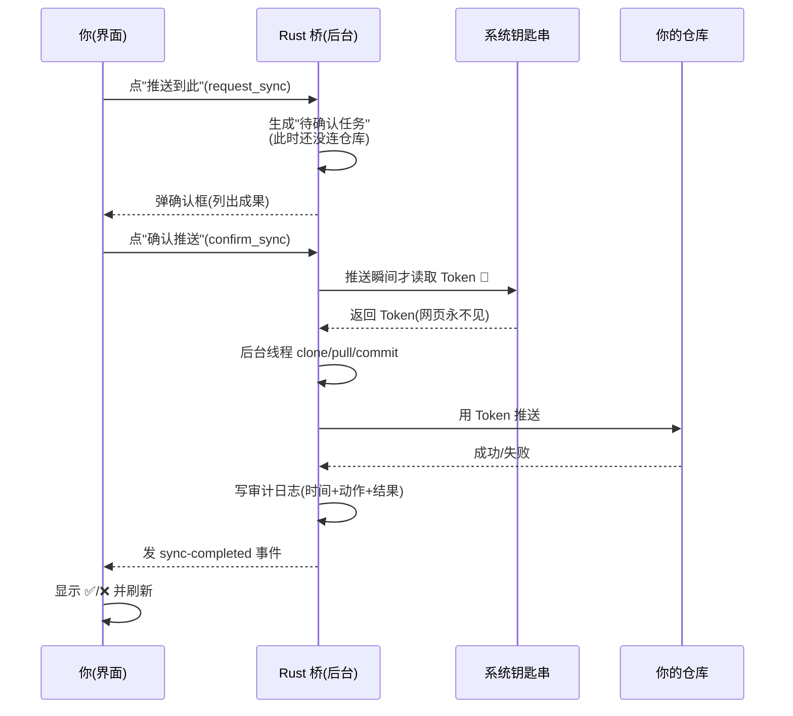
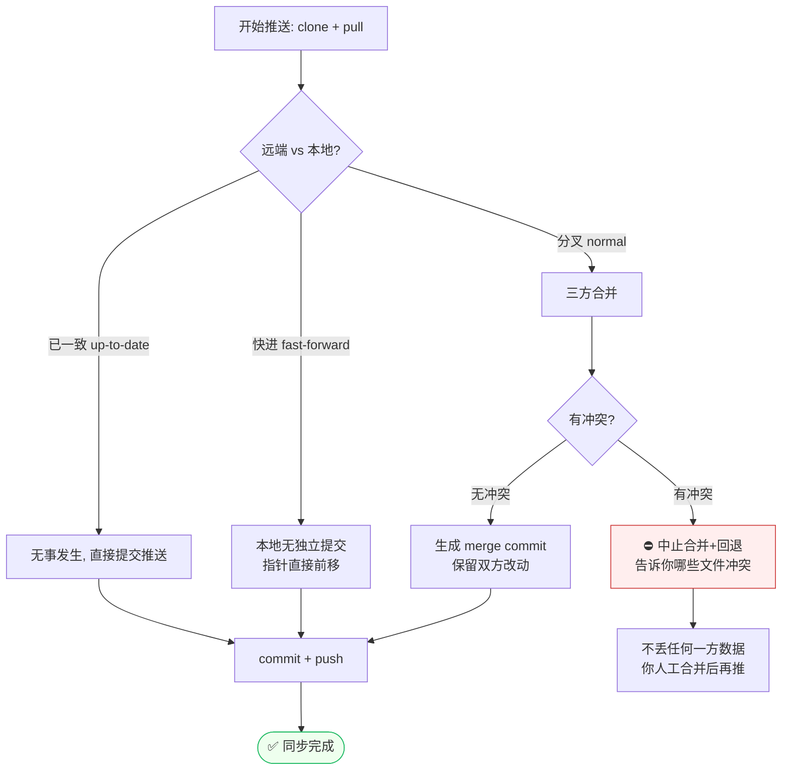
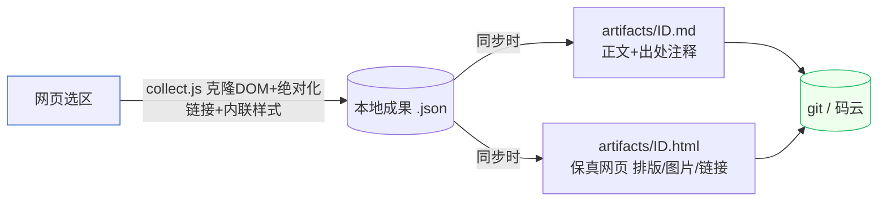
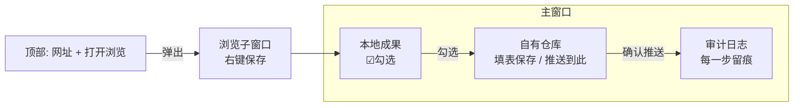

# 极智简单 · 浏览器OS融合 MVP — 操作流程图（图文版）

> 本文用流程图把"怎么用"和"背后怎么保护你"画清楚。
> 在 **GitHub / VS Code（装 Mermaid 插件）/ Typora / Obsidian** 里打开即可看到渲染成图；纯文本编辑器里也能直接读懂箭头逻辑。

---

## 图 1：整体闭环（你点什么 → 工具做什么）

```mermaid
flowchart TD
    A([打开软件<br/>npm run tauri dev]) --> B[配置仓库<br/>填地址+Token 保存]
    B --> C[顶部输入网址<br/>点"打开浏览"]
    C --> D[浏览子窗口打开网页]
    D --> E[网页里选中内容<br/>右键 → 保存到成果库]
    E --> F[(本地成果库<br/>带出处+溯源指纹)]
    F --> G[左侧勾选要同步的成果]
    G --> H[点仓库的"推送到此"]
    H --> I{弹出确认框}
    I -->|不点确认| J[什么都不上传 ✋]
    I -->|点"确认推送"| K[后台线程推送<br/>界面不卡]
    K --> L[(你的 git / 码云仓库<br/>.md + .html)]
    L --> M[✅ 推送成功]

    style J fill:#fee,stroke:#c33
    style M fill:#efe,stroke:#2b6
    style F fill:#eef,stroke:#36c
```

**一句话**：网页只负责"选"，按键只负责"存本地"，**只有你点头那一下**才会连仓库。

---

## 图 2：推送确认闸门 + 四条安全红线（时序）



| 红线 | 在图里哪一步生效 |
|------|------------------|
| ① 网页拿不到密码 | Token 只在"确认推送"那一刻从钥匙串读，网页脚本无权限 |
| ② 上传必须你点头 | `request_sync`（生成任务）→ 你点 `confirm_sync`（才真推） |
| ③ 全程审计 | 最后一步写审计日志，失败也记 |
| ④ 网页权限最小 | 只有"浏览子窗口"能调保存；主窗口禁远程 IPC |

---

## 图 3：推送前的仓库合并决策（你的数据不会丢）



**关键原则**：宁可推送失败、也**绝不悄悄覆盖**你或队友已有的内容。冲突时工具会退回去并明确告诉你"谁和谁打架了"。

---

## 图 4：文件落盘长什么样



---

## 图 5：三栏界面速记



---

## 怎么看这些图
- **GitHub / Gitee**：直接预览本 `.md`，Mermaid 自动渲染。
- **VS Code**：装扩展 `Markdown Preview Mermaid Support` 或 `bierner.markdown-mermaid`，预览即可。
- **Typora / Obsidian**：原生支持 Mermaid，打开即见图。
- 纯文本编辑器：箭头和括号里的文字已能说明流程，不影响理解。

> 配合 [`使用指南.md`](./使用指南.md) 一起看：本文是"图"，那是"字"，图文对照最清楚。
